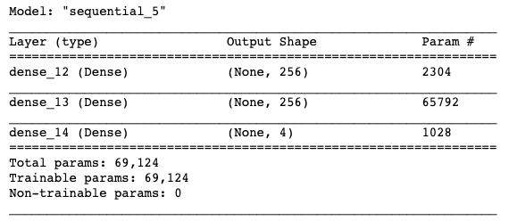

# Lunar Lander with Deep Q_Learning

This repository is a reinforcement learning project, we will use Deep Q_Learning to train our agent to land on lunar surface.


## Prerequisites

For this project you will need matplotlib, numpy, gym and tensorflow.

All the code is in python3, code files are in (.ipynb) format.

```
pip install matplotlib
pip install numpy
pip install tensorflow
pip install keras
pip install gym
pip install box2d
```

### Gym environments

We will use [LunarLander-v2](https://gym.openai.com/envs/LunarLander-v2/) environment from[Gym](http://gym.openai.com/) to train our agent.

# Agent-Env interaction


The agent will receive a state from our environment and he will take an action depending on the state, this action will result in a new state and a reward, agent will receive it and he will learn using these informations (state, action, new_state, reward) to learn and take better actions.

## Lunar_Lander

Lunar_lander with random agent.


Landing pad is always at coordinates (0,0). Coordinates are the first two numbers in state vector. Reward for moving from the top of the screen to landing pad and zero speed is about 100..140 points. If lander moves away from landing pad it loses reward back. Episode finishes if the lander crashes or comes to rest, receiving additional -100 or +100 points. Each leg ground contact is +10. Firing main engine is -0.3 points each frame. Solved is 200 points. Landing outside landing pad is possible. Fuel is infinite, so an agent can learn to fly and then land on its first attempt. Four discrete actions available: do nothing, fire left orientation engine, fire main engine, fire right orientation engine.ass. Therefore, the only way to succeed is to drive back and forth to build up momentum.

### env space
```
import gym
env = gym.make('LunarLander-v2')
env.observation_space.shape
>>> (8,)
env.action_space.sample()
>>>[ 0.00430889,  1.3992264 ,  0.43642968, -0.51972544, -0.00498616,
       -0.09885785,  0.        ,  0.        ]
print(env.action_space.n)
>>> 4
```
In this environment we have continous observation space with 8 inputs :
[x, y, x_velocity, y_velocity, lander_angel, angular_velocity, left_contact_bool, right_contact_bool]

and discret action space with 4 possible actions
0 : no action
1 : left_engine
2 : bottom engine
3 : right_engine

## Agent

To train this agent we will use [Deep Q Learning](https://www.cs.toronto.edu/~vmnih/docs/dqn.pdf). To implement it we need a memory to store agent-env interactions and a model and of course an agent class to handle the Q-values, memory and model.

### Model


Lunar_lander is a simple environement so we used a simple model with input layer of 8 noeuds, 2 hidden layers of 256 noeuds with relu activation function and output layer is 4 with linear activation function.

### Memory

We use it to store agent-env interactions (state, action, new_state, reward, done), during the training process we select a random samples from this memory to use it as a batch to train our model.

In this project we store the last 1_000_000 interactions, and for each step we select 64 random interaction from it.

### Training 


We train our agent for a number of episodes and for each episodes we have a number of steps that ends with a proper landing or a fail, for each step we will have a state, using this state we will take an action and we will get a reward, new_state and done flag if we finish the episode.

In each step :
* we take an action depending on the current state.
* we store all this informations in our memory.
* we select a sample from the memory.
* we calculate new Q_values for this sample.
* we train the model using states from the sample and the new Q_values.

#### Take action

To do it, we have 2 options random action or action predicted from the model.

* in the begining of the training we select random actions to explore our env.
* after we feed a state to the model and it will return Q_values(8). we select an action with the highest Q_value

in order to make this transition we have epsilon variable that we decrease after each episode. we take a random value from 0 to 1 if its higher than epsilon we predic an action if not we select a random one. 

#### Calculate  new Q_values

For each step from the sample memory we have (state, action, new_state, reward, done). Using our model we predict Q_values for state and futur_Q_values using the new state. 


we update Q_values[action] = reward + gamma * max(futur_Q_values)  if its not a terminal state( done == False)
                        or = reward                                if its a terminal state( done == True)


## Result


we simulated 2000 episodes for each one we have a score(sum of all rewards in one episode).

we can see that the score is low in the beginning because our agent wasn't trainned yet and we many take random action because epsilon is still high, we can make epsilon decay low to explore our env more but in this case we dont need it because its a simple game.

## Simulation

